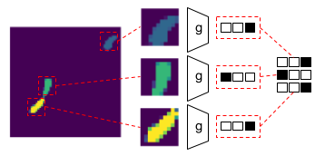

# neural-data-association

__Tl;dr:__ Learning data association without data association (using smoothness assumptions in observations). 

 

This repository provides a toy demonstration of the short letter paper:

> Burke and Ramamoorthy, Learning data association without data association: An EM approach to neural assignment prediction, [arXiv link](https://arxiv.org/abs/2105.00369).

Here, we show how a smooth dynamics assumption and a filtering or smoothing operation can be used to self-supervise [Sinkhorn network](https://github.com/HeddaCohenIndelman/Learning-Gumbel-Sinkhorn-Permutations-w-Pytorch) training. Results show that this outperforms supervised learning using hungarian algorithm assignment, and allows data association models to be learned without direct target labelling. 

The paper uses a mice tracking dataset, but this is only available on request from the original authors, so a toy coloured box tracking application is included here instead.

- [Demo_data_gen.ipynb](./Demo_data_gen.ipynb) shows an example of the environment used to generate data for training and testing.
- [Demo_sampler.ipynb](./Demo_sampler.ipynb) shows an example of the sampler used to randomise the measurement order of the synthetic data.
- [Demo_train.ipynb](./Demo_train.ipynb) trains a network to recognise patches centred on measurements using the proposed approach. This also includes a simple test case, and some fancy visualisations to demonstrate the learning process.

### Limitations

Unfortunately, despite the beauty of the derivations in this paper, the proposed approach is challenging to scale to more complex scenes. Although I don't doubt that this is possible, at present I have not been able to accomplish this on standard MOT tracking benchmarks. This is likely more a function of my own inferior hyperparameter and architecture design skills/ time constraints than anything else.

More importantly, the proposed approach assumes the number of targets is generally fixed and known ahead of time, and is more suited to the case where targets are not continually dying/born, as is the case in many multi-object tracking scenarios. In these cases, I believe set-based tracking or approaches that do not require data association may prove more valuable that tracking by detection. However, I think that the proposed approach has value in some table top manipulation tasks, some work we have conducted around deformable object component tracking, and many biological tracking applications where targets remain confined in a closed space. Scaling to missing targets is trivial, but a growing number less so.
